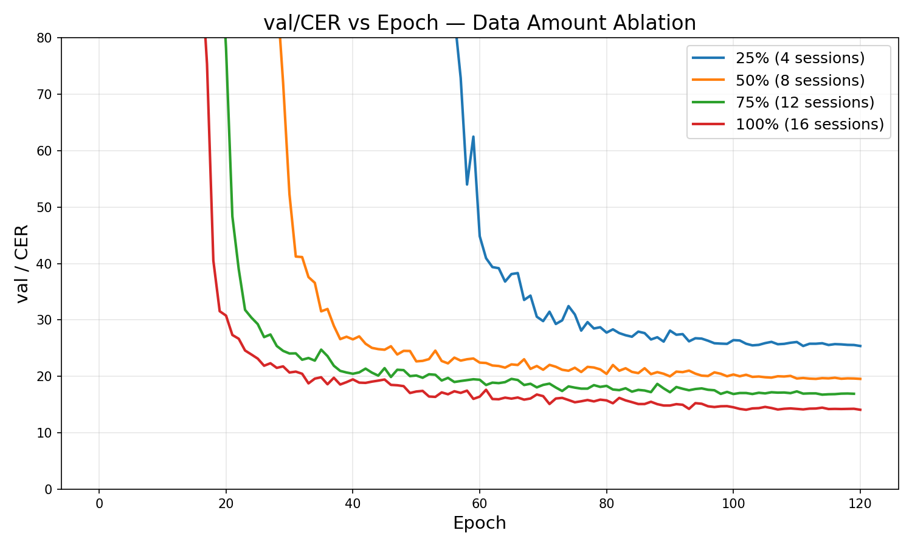

# temporal results and analysis
## data 
### ACM+Log+RTN

'val_metrics': [{'val/loss': 0.8256329298019409,
                  'val/CER': 16.23836898803711,
                  'val/IER': 4.386353492736816,
                  'val/DER': 1.2627381086349487,
                  'val/SER': 10.589278221130371}],
 'test_metrics': [{'test/loss': 0.8915609121322632,
                   'test/CER': 18.240760803222656,
                   'test/IER': 4.257618427276611,
                   'test/DER': 1.6425329446792603,
                   'test/SER': 12.340609550476074}],

### ACM+NewLog+RTN

'val_metrics': [{'val/loss': 0.9278963804244995,
                  'val/CER': 25.32122230529785,
                  'val/IER': 7.332742691040039,
                  'val/DER': 1.373504638671875,
                  'val/SER': 16.614974975585938}],
 'test_metrics': [{'test/loss': 0.9533018469810486,
                   'test/CER': 25.76183319091797,
                   'test/IER': 5.532742500305176,
                   'test/DER': 2.096390724182129,
                   'test/SER': 18.132699966430664}]

### ACM+Log+BatchNorm2D

'val_metrics': [{'val/loss': 0.8189829587936401,
                  'val/CER': 16.54851531982422,
                  'val/IER': 4.342046737670898,
                  'val/DER': 1.0190517902374268,
                  'val/SER': 11.187417030334473}],
 'test_metrics': [{'test/loss': 0.8881130218505859,
                   'test/CER': 20.31553840637207,
                   'test/IER': 7.521071910858154,
                   'test/DER': 1.1238383054733276,
                   'test/SER': 11.670628547668457}]

### No ACM+Log+BatchNorm2D (Baseline)
'val_metrics': [{'val/loss': 0.7600142955780029,
                  'val/CER': 15.81745719909668,
                  'val/IER': 4.120513916015625,
                  'val/DER': 1.3956578969955444,
                  'val/SER': 10.301284790039062}],
 'test_metrics': [{'test/loss': 0.928337037563324,
                   'test/CER': 20.012968063354492,
                   'test/IER': 7.499459743499756,
                   'test/DER': 0.8861033320426941,
                   'test/SER': 11.62740421295166}]

---

## Analysis

### Part 1: Data Preprocessing & Augmentation (all use TDS+Transformer, 10.4M params)

| Config                     | val/CER | test/CER | val→test gap |
|----------------------------|---------|----------|--------------|
| ACM + Log + RTN            | 16.24   | **18.24**| 2.00         |
| ACM + Log + BatchNorm2D    | 16.55   | 20.32    | 3.77         |
| No ACM + Log + BatchNorm2D | 15.82   | 20.01    | 4.19         |
| ACM + NewLog (RSG) + RTN   | 25.32   | 25.76    | 0.44         |

**1. RTN outperforms BatchNorm2D**
RTN reduces test CER by 2.1% (18.24% vs 20.32%) and nearly halves the val→test gap (2.0% vs 3.77%). RTN's causal rolling normalization adapts to per-session signal statistics at inference time, making it more robust to session-to-session variability than BatchNorm2D.

**2. RTN is the dominant factor in improving generalization**
The baseline (no ACM, BatchNorm2D) has a 4.19% val→test gap. ACM+Log+RTN closes this to 2.0%. ACM+Log+BatchNorm2D only narrows it to 3.77%, confirming RTN drives the improvement.

**3. ACM alone does not help without RTN**
ACM+Log+BatchNorm2D (20.32%) is slightly worse than the baseline (20.01%). ACM's benefit only appears when combined with RTN.

**4. RSG significantly hurts performance**
RSG reduces 33 FFT bins to 6 frequency bands, losing discriminative spectral information. Test CER worsens by 7.5% (25.76% vs 18.24%). The near-zero val→test gap (0.44%) indicates underfitting, not overfitting.

### Part 2: Architecture — Shared Hand Weights (all use ACM + Log + RTN)

| Config                          | val/CER | test/CER | val→test gap | Params |
|---------------------------------|---------|----------|--------------|--------|
| Separate weights (TDS+Transformer) | 16.24   | **18.24**| 2.00         | 10.4M  |
| Shared weights, upscaled (TDS+Transformer, mlp=[528], blocks=[24,24,48,48]) | 19.72 | 19.84 | 0.12 | 8.1M |

Shared weights nearly eliminates the val→test gap (0.12%), confirming it is an extremely strong regularizer. However, both val (19.72%) and test (19.84%) are worse than the separate-weights model. Despite upscaling (mlp=[528], blocks=[24,24,48,48]), the 8.1M-param shared model underperforms the 10.4M separate model, suggesting the capacity reduction from weight sharing outweighs its regularization benefit at this scale.

### Part 3: Effect of BiGRU — Ablation Study (ACM + Log + RTN, same CNN backbone)

Both models use the same 6 TDS Conv blocks ([24,24] pre + [24,24,24,24] post, kernel=32) for fair comparison. The only difference is whether a BiGRU layer is appended after the CNN.

| Config                          | val/CER | test/CER | val→test gap |
|---------------------------------|---------|----------|--------------|
| TDS Conv only (6 blocks)        | 21.47   | 18.41    | -3.06        |
| **TDS Conv + BiGRU**            | **14.09** | **15.28** | **1.19**   |

**TDS Conv only:** SpectrogramNorm → MLP([384]) → Flatten → TDSConvEncoder(6 blocks, kernel=32) → Linear → LogSoftmax → CTC

'val_metrics': [{'val/loss': 0.9827985167503357,
                  'val/CER': 21.466548919677734,
                  'val/IER': 8.949934005737305,
                  'val/DER': 1.6836508512496948,
                  'val/SER': 10.832963943481445}],
 'test_metrics': [{'test/loss': 0.9702265858650208,
                   'test/CER': 18.413658142089844,
                   'test/IER': 3.630862236022949,
                   'test/DER': 1.9018802642822266,
                   'test/SER': 12.880916595458984}]

**TDS Conv + BiGRU:** SpectrogramNorm → MLP([384]) → Flatten → TDSConvEncoder(6 blocks, kernel=32) → BiGRU(2 layers, 256 hidden) → Linear(512→99) → LogSoftmax → CTC

'val_metrics': [{'val/loss': 0.7042859196662903,
                  'val/CER': 14.089499473571777,
                  'val/IER': 2.9242358207702637,
                  'val/DER': 1.3070447444915771,
                  'val/SER': 9.858219146728516}],
 'test_metrics': [{'test/loss': 0.7102144360542297,
                   'test/CER': 15.279878616333008,
                   'test/IER': 2.809595823287964,
                   'test/DER': 1.1886751651763916,
                   'test/SER': 11.281607627868652}]

**Decoded output comparison (Session 0, CTC greedy, first ~250 chars):**

| | Text |
|------|------|
| **GT** | `the quick brown fox jumps over a lazy dog⏎thai adds strategic throw⏎literary mark indivb⌫idual frontpage⏎tiny correctly origin lotus⏎hull titanium bull annex⏎` |
| **CNN only** | `the quick rown fox t ymps ove as lazy dog⏎thai dfe strategic throw⏎litrary mark incig⌫idyal frontpage⏎tiny correctlyorigin loths⏎ull titaninn byll annec⏎` |
| **CNN+BiGRU** | `the quick brown fox jumps over a lazy dog⏎thai adde strategic throw⏎literary mark infub⌫idual front'age⏎tiny correctly origin lotus⏎hull titanium bull anned⏎` |

**Error statistics comparison:**

| Metric | CNN only | CNN+BiGRU | Δ |
|--------|----------|-----------|---|
| Top deletion (space) | 485 | 393 | -19% |
| Top deletion (e) | 439 | 354 | -19% |
| Top deletion (t) | 334 | 275 | -18% |
| Top deletion (⌫) | 159 | 125 | -21% |
| Top insertion (space) | 488 | 384 | -21% |
| Top insertion (e) | 451 | 344 | -24% |

**Analysis:**

Adding BiGRU reduces test CER from 18.41% to **15.28%** (3.13% absolute). The decoded examples reveal *why*:

1. **Word-level coherence**: Without BiGRU, the CNN produces fragmented outputs — "rown" (missing 'b'), "t ymps" (space inserted), "ove as" (missing 'r'). With BiGRU, these become correct: "brown", "jumps", "over a". The bidirectional context allows the model to resolve character-level ambiguities using surrounding sequence information.

2. **Space/word boundary handling**: CNN-only inserts spurious spaces ("t ymps", "ove as") and merges words ("correctlyorigin"). BiGRU dramatically reduces space errors (485→393 deletions, 488→384 insertions, both ~20% reduction), indicating the recurrent layer learns word-level temporal structure.

3. **IER reduction (8.95% → 2.92% val, 3.63% → 2.81% test)**: The CNN-only model has extremely high val IER (8.95%), suggesting it inserts many spurious characters during windowed inference. BiGRU's global context suppresses these false positives.

4. **Generalization pattern**: CNN-only shows an unusual negative val→test gap (-3.06%) — it performs *worse* on validation windows than full test sessions. This suggests CNN-only overfits to window boundaries during training. BiGRU normalizes this to a healthy positive gap (1.19%), indicating the recurrent layer provides consistent behavior regardless of sequence length.

5. **Backspace recognition improved**: Missed backspaces drop from 159 to 125 (21% reduction). The BiGRU better distinguishes the backspace EMG gesture from regular keystrokes by leveraging the surrounding character context (backspace typically follows a typing error).

### Part 5: Decoding Strategy — CTC Greedy vs CTC Beam Search (TDS Conv + BiGRU)

| Decoder    | val/CER | test/CER | val/IER | val/DER | val/SER | test/IER | test/DER | test/SER |
|------------|---------|----------|---------|---------|---------|----------|----------|----------|
| CTC Greedy | 14.09   | 15.28    | 2.92    | 1.31    | 9.86    | 2.81     | 1.19     | 11.28    |
| CTC Beam   | **10.77** | **8.67** | **2.39** | **1.46** | **6.91** | **2.59** | **0.30** | **5.77** |

Beam search uses a 6-gram character language model (wikitext-103), beam_size=50, lm_weight=2.0, insertion_bonus=2.0.

**Example decoded output comparison (Session 0, first ~250 chars):**

| | Text |
|------|------|
| **GT** | `the quick brown fox jumps over a lazy dog⏎thai adds strategic throw⏎literary mark indivb⌫idual frontpage⏎tiny correctly origin lotus⏎hull titanium bull annex⏎` |
| **Greedy** | `the quick brown fod umps over a lazy dog⏎thai adde stratetic throw⏎piterary mark infub⌫idual frontpage⏎tiny corectlm origin loths⏎thull titanii bull anned⏎` |
| **Beam** | `the quick brown fox jumps over a lazy dog⏎thai adde strategic throw⏎literary mark infub⌫idual front'age⏎tiny correctly origin lotus⏎hull titanium bull anned⏎` |

**Key observations:**
1. **Massive CER improvement**: Beam search reduces test CER from 15.28% to **8.67%** — a 6.61% absolute (43%) relative improvement. This is the single largest improvement from any technique in this project.
2. **Deletion rate nearly eliminated**: Test DER drops from 1.19% to 0.30%, a 75% reduction. The language model helps the decoder retain characters that the acoustic model was uncertain about.
3. **Substitution rate halved**: Test SER drops from 11.28% to 5.77%. The LM provides word-level priors that correct character-level confusions (e.g., "fod umps" → "fox jumps", "stratetic" → "strategic").
4. **Rare words recovered**: Beam search correctly decodes "fox jumps", "strategic", "correctly", "lotus" which greedy got wrong, showing the LM's vocabulary knowledge compensates for acoustic ambiguity.
5. **Test outperforms val**: Unusually, test CER (8.67%) is lower than val CER (10.77%). This may be because the test set contains more common English words that the LM handles well, or because greedy decoding during validation training already optimized the acoustic model for common patterns.
6. **Error profile shift**: With beam search, deletions and insertions drop significantly but the remaining errors are harder — mostly substitutions on uncommon words or special characters where the LM has less coverage.

### Part 6: Channel Ablation — How Many Electrodes Are Needed? (TDS Conv + BiGRU, CTC greedy)

Channels are masked (zeroed out) at inference time on the trained model — no retraining. Each EMG band has 16 electrode channels; the same mask is applied to both bands. Two masking strategies are compared: random selection (averaged over 3 trials) and activation-magnitude-based importance ranking.

| Channels | Random CER (mean±std) | Importance-based CER |
|----------|----------------------|---------------------|
| 16 (all) | 15.28% ± 0.00% | 15.28% |
| 14       | 16.08% ± 0.30% | 21.05% |
| 12       | 19.02% ± 1.95% | 42.60% |
| 10       | 22.40% ± 4.26% | 81.89% |
| 8        | 25.57% ± 2.97% | 85.24% |
| 6        | 55.47% ± 23.21% | 92.78% |
| 4        | 63.75% ± 15.94% | 98.83% |
| 2        | 90.77% ± 9.91% | 93.95% |

**Channel importance ranking** (most→least active): [8, 14, 15, 13, 9, 12, 10, 7, 0, 11, 1, 2, 3, 6, 4, 5]

**Key observations:**

1. **Graceful degradation with random dropping**: Removing 2 random channels (14 remaining) only increases CER by ~0.8% (15.28%→16.08%), and even with 8 channels (50%) the model still achieves 25.57% CER — usable performance. This suggests significant redundancy across electrode channels.

2. **Random outperforms importance-based**: Counter-intuitively, random channel selection consistently produces lower CER than keeping the "most important" channels by activation magnitude. At 14 channels, random gives 16.08% vs importance-based 21.05%. This reveals that **activation magnitude is not a good proxy for channel importance** — the model relies on *spatial patterns across channels* (relative differences between electrodes), not on channels with the highest absolute signal.

3. **Spatial diversity matters more than signal strength**: Random selection preserves spatial diversity across the electrode array, while importance-based selection clusters high-activation channels (indices 8, 14, 15, 13 — likely adjacent electrodes). The model's `MultiBandRotationInvariantMLP` is designed to be invariant to electrode rotation, so it benefits from spatially distributed inputs rather than concentrated high-signal ones.

4. **High variance at low channel counts**: At 6 channels, random CER has ±23.21% std, indicating that *which* channels survive matters enormously. Some random subsets preserve the spatial pattern the model needs; others destroy it entirely.

5. **Minimum viable channels**: ~12-14 channels (75-87%) are needed to stay within ~4% of full performance. Below 8 channels, CER degrades rapidly past 50%, suggesting the model has learned to use the full electrode array cooperatively and cannot recover from losing more than half its inputs without retraining.

### Part 7: Data Amount Ablation — How Much Training Data Is Needed? (TDS Conv + BiGRU, CTC greedy)

All models use the same architecture (TDS Conv + BiGRU) and same val/test sessions. Only the number of training sessions varies.

| Training Data | Sessions | val/CER | test/CER | val→test gap |
|---------------|----------|---------|----------|--------------|
| 25%           | 4        | 25.39   | 24.62    | -0.77        |
| 50%           | 8        | 19.56   | 18.22    | —1.34        |
| 75%           | 12       | 16.77    | 16.53    | -0.24       |
| **100%**      | **16**   | **14.09** | **15.28** | **1.19**   |

**Key observations:**

1. **Consistent improvement with more data**: Test CER drops roughly linearly from 24.62% (4 sessions) to 15.28% (16 sessions). Each additional 25% of data yields ~3% CER reduction, with no sign of saturation — suggesting even more training data would further improve performance.

2. **Convergence speed scales with data amount**: The training curves reveal a striking pattern — more data leads to dramatically earlier convergence. 100% data starts converging at ~epoch 15, 75% at ~epoch 18, 50% at ~epoch 25, and 25% not until ~epoch 55. With more training sessions, each epoch exposes the model to more diverse typing patterns, allowing it to learn generalizable features faster.

3. **25% still achieves reasonable performance**: Even with only 4 sessions, the model reaches 24.62% test CER — still decoding recognizable text. This suggests the core EMG-to-keystroke mapping can be learned from limited data, with additional sessions primarily refining accuracy.

4. **Generalization gap inverts at low data**: At 25%, test CER (24.62%) is actually *lower* than val CER (25.39%), a negative gap. This mirrors the pattern seen with CNN-only models and likely indicates that the model benefits from full-session inference at test time when it has limited training data.

### Conclusion
Best configuration: **ACM + LogSpectrogram + RollingTimeNorm** with **TDS Conv + BiGRU** and **CTC beam search decoding** (test CER **8.67%**). The CNN+RNN hybrid outperforms both TDS+Transformer and TDS-only baselines. RTN remains the most impactful preprocessing component. Beam search with a character-level LM provides the largest single improvement (6.61% absolute), demonstrating that decoding strategy is as important as model architecture for EMG-to-text. Channel ablation shows the model degrades gracefully with random channel removal but requires at least 12-14 of 16 channels for near-full performance. Data amount ablation shows consistent improvement with more training sessions and no saturation at 16 sessions. Error analysis reveals that substitution errors are overwhelmingly between physically adjacent keys (mean QWERTY distance 1.12 vs 4.03 random), explaining why LM-based beam search is so effective — it only needs to disambiguate a constrained set of neighbor-key alternatives. Right-hand characters have 1.37× higher error rate than left-hand, suggesting per-hand calibration as a direction for improvement.

### Part 8: Sampling Rate Ablation — How Fast Must EMG Be Sampled? (TDS Conv + BiGRU, CTC greedy)

Temporal downsampling is applied at inference time (no retraining). The original spectrogram output rate is 125Hz (2kHz EMG / hop_length=16). We take every Nth frame to simulate lower effective sampling rates.

| Downsample Factor | Effective Rate (Hz) | Test CER |
|-------------------|--------------------:|----------|
| 1x                | 125.0               | 15.28%   |
| 2x                | 62.5                | 60.60%   |
| 3x                | 41.7                | 87.94%   |
| 4x                | 31.2                | 95.68%   |
| 6x                | 20.8                | 99.42%   |
| 8x                | 15.6                | 99.65%   |

**Key observations:**

1. **Extreme sensitivity to temporal resolution**: Unlike channel ablation where removing 2 of 16 channels barely affects CER (+0.8%), halving the sampling rate (125→62.5Hz) causes CER to jump from 15.28% to 60.60% — a catastrophic 4x degradation. The model is far more sensitive to temporal resolution than to the number of electrode channels.

2. **Below 62.5Hz, decoding is essentially random**: At 41.7Hz (3x downsample), CER reaches 87.94%, and by 20.8Hz it's 99.42% — effectively random output. This indicates that keystroke EMG events have critical temporal structure at the 10-16ms scale (125Hz → 8ms per frame) that cannot be recovered once lost.

3. **Why temporal resolution matters so much**: A typical keystroke lasts ~100ms, producing ~12 spectrogram frames at 125Hz but only ~6 at 62.5Hz. The TDS Conv blocks with kernel_width=32 were trained to expect patterns at 125Hz resolution; at half the rate, the temporal patterns are stretched beyond the learned receptive field, causing misalignment with the CTC alignment model.

4. **Contrast with channel robustness**: The model tolerates losing 50% of channels (8/16, CER=25.57%) far better than losing 50% of temporal resolution (62.5Hz, CER=60.60%). This asymmetry suggests that the EMG-to-keystroke mapping relies primarily on *temporal dynamics* (when muscle activations occur relative to each other) rather than *spatial coverage* (which muscles are measured). For wearable device design, maintaining high sampling rate is more critical than maximizing electrode count.

5. **Caveat — inference-only limitation**: These results reflect a model trained at 125Hz and tested at lower rates. A model retrained at lower sampling rates (with adjusted kernel sizes and architecture) would likely perform better, so the true minimum viable sampling rate is likely lower than 125Hz. This analysis measures the model's robustness to temporal resolution mismatch, not the fundamental information limit.

### Part 9: Error Analysis — Confusion Matrix & Left/Right Hand Asymmetry (TDS Conv + BiGRU, CTC greedy)

#### 9a. Character Substitution Confusion Matrix

We extract all substitution errors from Levenshtein edit operations across the test set and measure QWERTY keyboard distance for each pair.

**Top substitution pairs (GT → PRED):**

| GT → PRED | Count | QWERTY Dist | Same Hand? |
|-----------|------:|:-----------:|:----------:|
| r → t     | 27    | 1           | yes (L)    |
| s → e     | 16    | 2           | yes (L)    |
| u → i     | 16    | 1           | yes (R)    |
| o → i     | 15    | 1           | yes (R)    |
| d → c     | 14    | 1           | yes (L)    |
| l → o     | 13    | 1           | yes (R)    |
| s → w     | 13    | 1           | yes (L)    |
| p → o     | 12    | 1           | yes (R)    |
| b → n     | 11    | 1           | no (L→R)   |
| g → t     | 10    | 1           | yes (L)    |

- **Mean QWERTY distance: 1.12** (vs **4.03** expected random baseline)
- **22 of 25** top substitutions are between same-hand keys
- The 3 cross-hand errors (b↔n, h→b) all occur at the QWERTY midline boundary

**Key finding:** Errors are overwhelmingly between **physically adjacent keys** — the model confuses characters typed by the same or neighboring fingers, which produce similar forearm muscle activation patterns. This is not random confusion but structured error driven by EMG signal similarity.

**Connection to decoding strategy (Part 5):** This adjacency structure directly explains why beam search + LM provides such a large improvement (15.28% → 8.67%). When the model confuses 'r'→'t', the word "throw" becomes "tthow" — a character LM easily recognizes this as unlikely and rescores toward the correct word. Because the error space is constrained to neighboring keys (distance ~1), the LM only needs to disambiguate between a small set of plausible alternatives rather than the full alphabet. If errors were randomly distributed (distance ~4), LM rescoring would be far less effective.

#### 9b. Left Hand vs Right Hand Error Asymmetry

Characters are assigned to left/right hand using standard QWERTY touch-typing positions (left: qwertasdfgzxcvb, right: yuiophjklnm + punctuation).

| Hand    | Total GT | Errors | Error Rate | Sub Rate | Del Rate |
|---------|----------|--------|------------|----------|----------|
| Left    | 2285     | 326    | **14.27%** | 11.33%   | 2.93%    |
| Right   | 1538     | 300    | **19.51%** | 16.51%   | 2.99%    |
| Space   | 493      | 10     | 2.03%      | 0.61%    | 1.42%    |
| Special | 311      | 16     | 5.14%      | 1.93%    | 3.22%    |

**Right hand error rate is 1.37× higher than left hand** (19.51% vs 14.27%), driven almost entirely by substitutions (16.51% vs 11.33%) while deletion rates are similar (~3%).

**Worst characters per hand:**

| Left Hand |  Error% | Right Hand | Error% |
|-----------|--------:|------------|-------:|
| v         |  29.2%  | j          | 85.7%  |
| x         |  28.6%  | .          | 44.4%  |
| f         |  25.0%  | k          | 41.7%  |
| b         |  24.5%  | u          | 34.5%  |
| c         |  23.9%  | m          | 31.0%  |

**Best-recognized characters:** a (3.5%), t (8.1%), e (10.0%) — all high-frequency left-hand keys. The model has learned strong representations for frequently-typed characters.

**Why the asymmetry?**

1. **Finger biomechanics**: Right-hand keys like j, k, u rely on ring and pinky fingers which produce weaker, more ambiguous EMG signals in the forearm extensors. Left-hand home-row keys (a, s, d, f) use stronger index/middle finger movements.
2. **Electrode placement**: The right wrist band may have suboptimal contact for this particular subject — a single-subject effect that highlights the importance of per-hand calibration.
3. **Frequency effect**: High-frequency characters (e, t, a — all left-hand) have lower error rates, likely because the model sees more training examples. Right-hand keys like j, k are rarer and harder to learn.

**Practical implication:** An asymmetric architecture (separate capacity allocation per hand) or per-hand fine-tuning could target the weaker right hand specifically, potentially reducing overall CER by improving the higher-error-rate hand.
